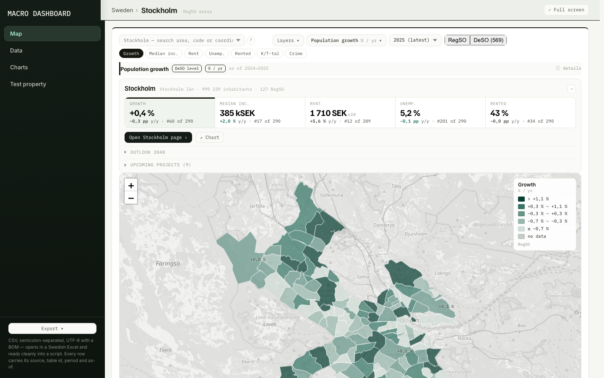
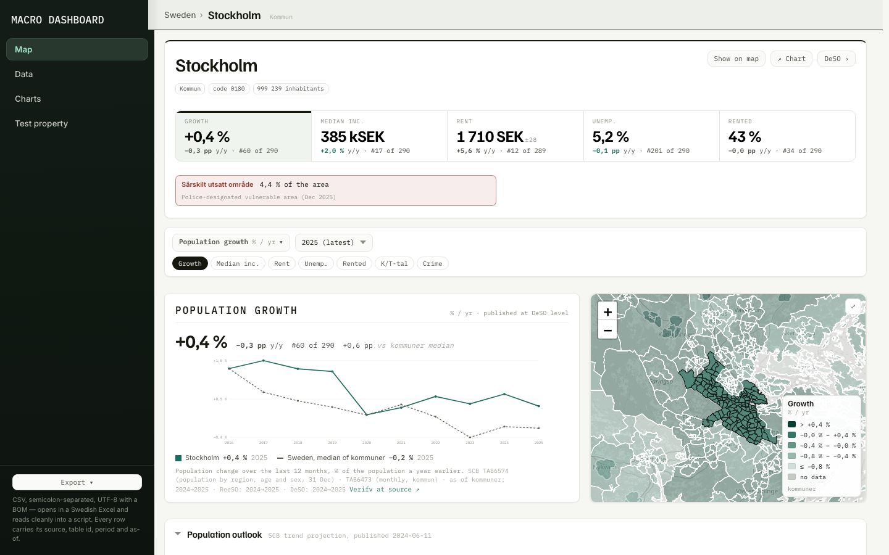
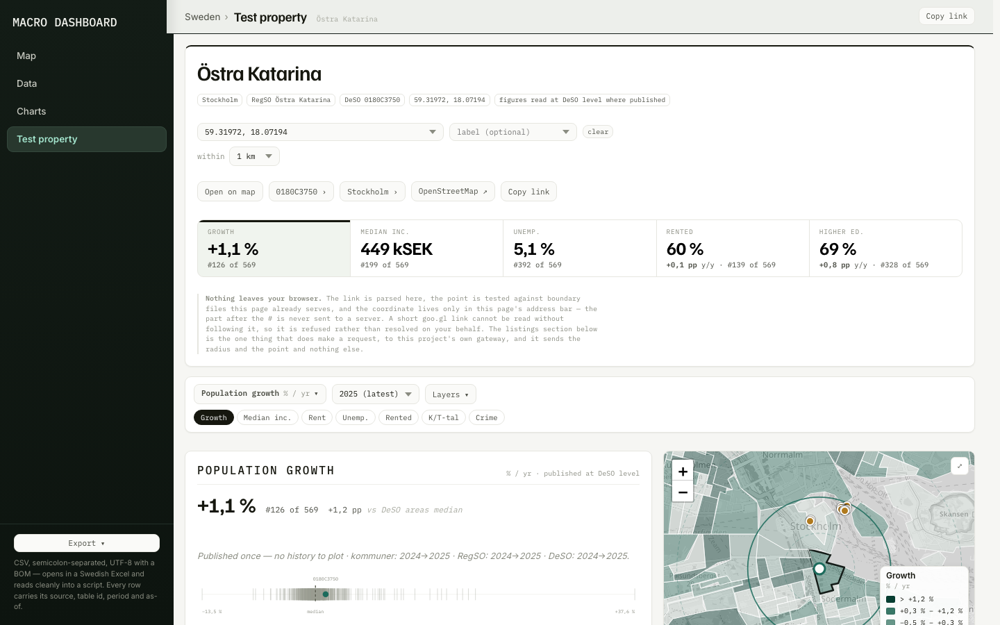
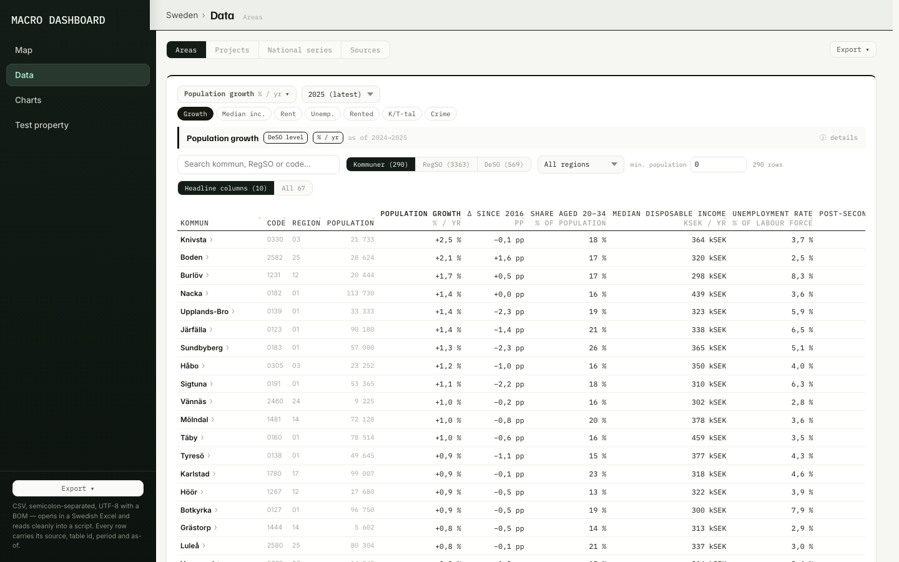
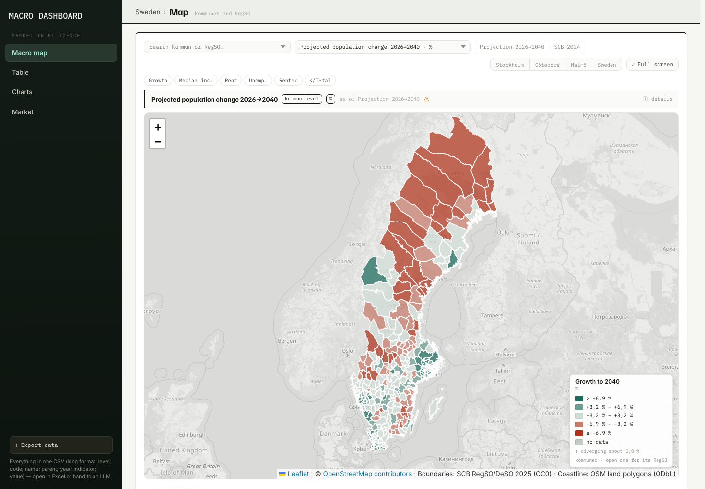
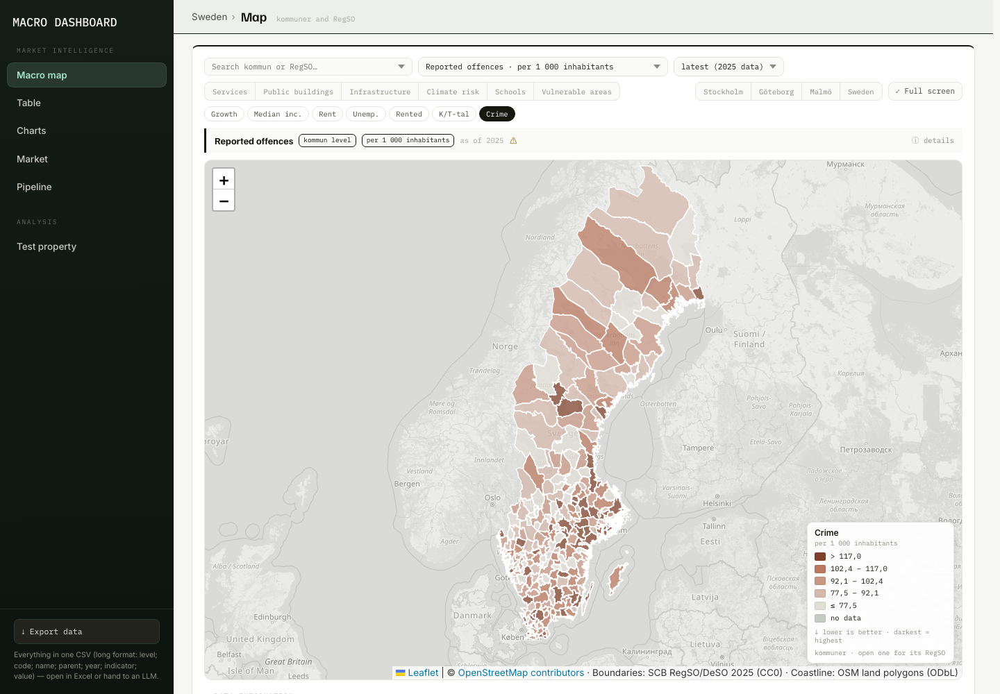
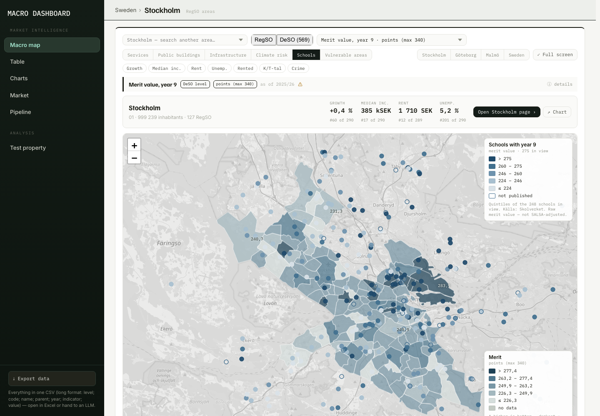
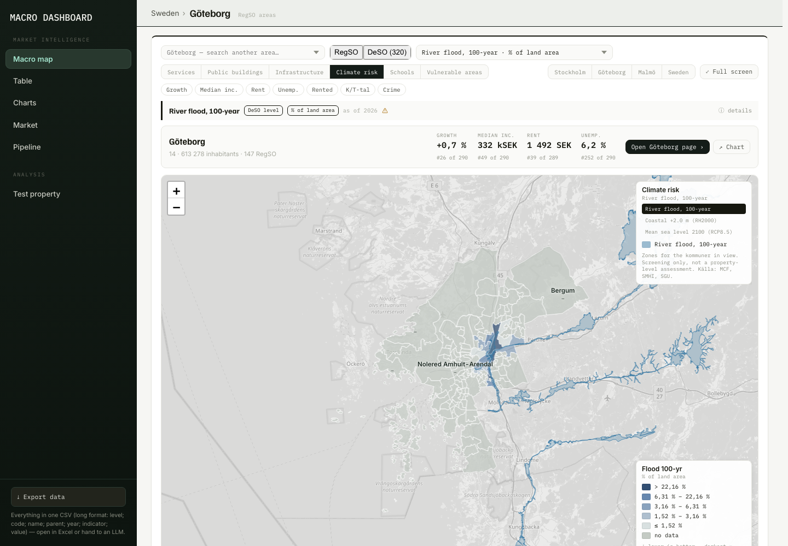
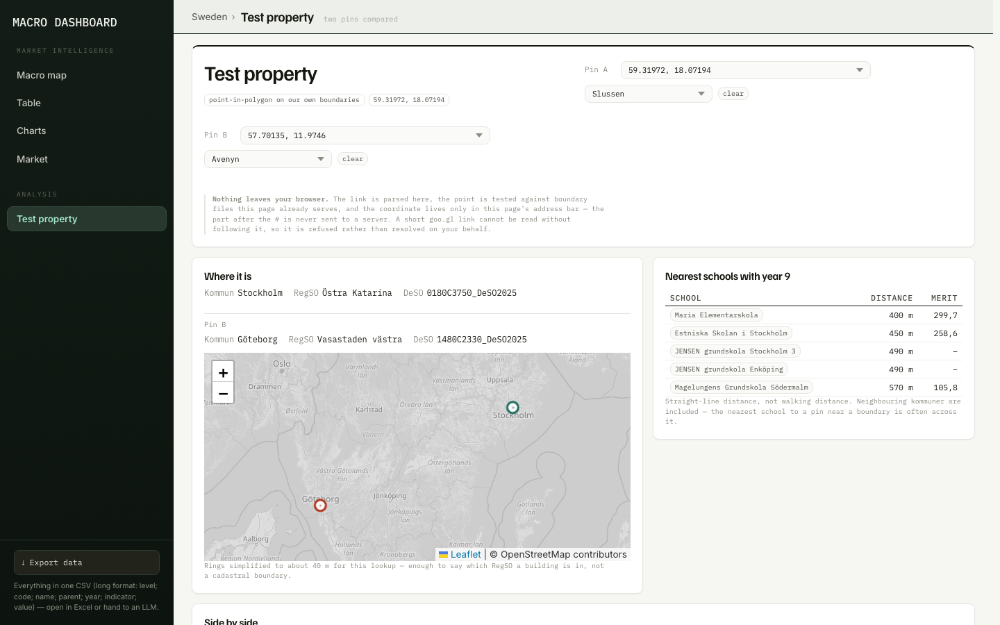
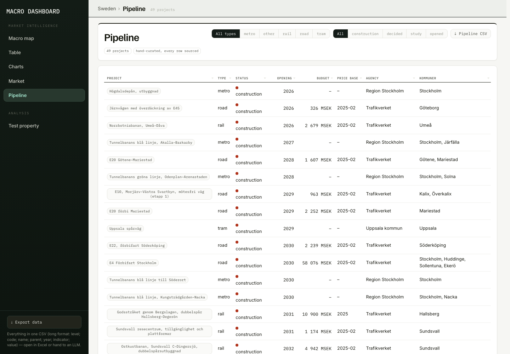

# AM Dashboard — Sweden edition

An open-data macro and market dashboard for the Swedish housing market: 290 kommuner,
3 363 RegSO neighbourhoods and 6 160 DeSO areas on one map, with the indicators an asset
manager actually looks at — population and age structure, income, education, tenure mix,
labour status, rents, construction and prices.

Everything comes from public Swedish sources, chiefly **Statistics Sweden (SCB)**, whose
statistical database is keyless and licensed **CC0**. The pipeline is plain Python
(standard library only) and runs on your own machine; the output is a single
self-contained HTML page.

**Live: https://real-estate-war-lord.github.io/am-dashboard-se/**

Sibling project: [am-dashboard-dk](https://github.com/real-estate-war-lord/am-dashboard-dk)
— the Danish edition, whose design this one inherits.

## Geo requirements

The data pipeline is standard-library Python. Three steps are the exception and
are kept behind their own requirements file, run by hand, with their output
committed — so `make build` never needs any of them:

```sh
python3 -m venv .venv && .venv/bin/pip install -r requirements-geo.txt
```

| Step | Needs | Why |
|---|---|---|
| `make polisen`, `make climate` | **shapely** | polygon intersection for the area shares |
| `make services`, `make infra` | **pyosmium** | reading the Geofabrik `.osm.pbf` country extract |

`pyosmium` is the same libosmium that the `osmium` command-line tool wraps —
`brew install osmium-tool` gives the CLI equivalent (`osmium tags-filter`,
`osmium export`) if you prefer it. `scripts/extract_osm_pbf.py` uses the Python
binding because it does the whole job in one pass instead of writing an
intermediate GeoJSON of the whole country.

The extract itself is not committed (818 MB):

```sh
mkdir -p data/raw/osm_pbf && curl -L -o data/raw/osm_pbf/sweden-latest.osm.pbf \
  https://download.geofabrik.de/europe/sweden-latest.osm.pbf
```

## What's new in v2.0 — "one of everything"

The same data, rebuilt around one of each thing. Seven destinations became four, three
grouped `<select>`s became one indicator picker, six overlay buttons became one Layers
menu, two pages became one Test property, and four exporters became one schema.

- **Four destinations** — Map · Data · Charts · Test property, with Export ▾ in the
  sidebar footer. Market, Pipeline and Sources are tabs of Data; the old Market view's
  four large charts are one National series table with a sparkline and a source on every
  row. Every old link still works: `src/route_core.js` holds the alias table, it is
  unit-tested, and it rewrites in place so Back still goes where you came from.
- **One indicator picker** on the Map, the Area page, Data › Areas, Charts and Test
  property. Search, every group, the unit, ↓ for lower-is-better, and an availability tag
  — the history span, or `snapshot`, or `projection` / `scenario` for the two families
  that have no year to select. On a RegSO or DeSO page the indicators that would be
  showing the kommun's figure are listed under **From the municipality**, because that is
  a different claim about the same number.
- **One period control**, in whichever of four modes the indicator needs, and labelled
  with **its** latest period rather than the dashboard's. The quarterly toggle is real:
  reported offences are published as a rolling four-quarter sum, and `y=2025K4` is a
  period like any other.
- **The area page is a study row** — the chart panel and a draggable mini-map, same
  height, one indicator at a time — with the 13-group KEY FIGURES block gone and four
  toggles whose open state is in the URL. Below kommun level an inherited figure says
  "municipality figure" in words; the lone `°` is gone from every table and tile.
- **Test property reads every layer at one pin**, and the Listings page is a section of
  it rather than a second application at a second address: what is advertised nearby,
  next to what SCB publishes for the same ground, with the caveat that keeps those two
  apart on the same screen as both of them.
- **Rental listings are a map layer too**, grouped HomeQ / landlord portals / municipal
  queues, from zoom 13. The gateway gained `GET /bbox` for it — a viewport is a
  rectangle, and answering one with a radius either misses the corners or over-fetches.
- **One export schema.** Seven items, one long format, and a unit check that runs before
  the file is written: a kSEK column holding SEK is the mistake it guards.
- **Responsive as a layout, not a patch.** No horizontal overflow at 1366, 1440, 1536 or
  390; at 1024 and below the sidebar is a top bar with a drawer.

### Routes

| Route | What it is |
|---|---|
| `#map[/<kommun>[/deso]]` | the map, optionally drilled into one kommun |
| `#data/areas/<kommun\|regso\|deso>` | every area side by side |
| `#data/projects` · `#data/national` · `#data/sources` | the other three Data tabs |
| `#charts?ind=&a=` | the chart generator |
| `#area/<kommun\|regso\|deso>/<code>` | one area |
| `#property?p=lat,lon[:label]` | one pin, read against every layer |
| `#school/<code>` · `#project/<id>` | the two datasheets |

Shared keys: `ind` · `y` (a year or a quarter) · `fq=q` · `lay` · `zones=0` · `show` ·
`rad` · `cols=all` · `c`/`z` (the map camera). A key is written only when it differs from
the default, so a link stays readable. Old spellings — `#table/*`, `#pipeline`,
`#market`, `#sources`, `#analysis?a=`, `#compare?a=`, the five overlay flags, `?t=`/`?g=`
and `listings.html#at=` — all redirect.

### Screenshots

| | |
|---|---|
|  |  |
| One toolbar row, the area card, the layers menu | The study row: chart panel and draggable mini-map |
|  |  |
| One pin, every layer, advertised rents beside SCB's | Areas, with the headline columns by default |

The full review set — every route at 1440 and at 390 — is in [`docs/ui_v2/`](docs/ui_v2).

## What's new in v1.2 — "Sweden parity"

Six new indicator groups, four map overlays, a pin you can drop from a Google Maps
link, and a project pipeline. Full source table in [`docs/PARITY.md`](docs/PARITY.md).

- **Outlook** — SCB's trend projection to 2040: population change, and four age bands.
  Shown on a diverging scale about flat, dashed in Charts, and never mixed with
  observed history. 35 of 35 values recomputed straight from the API.
- **Safety** — reported offences per kommun from Brå, 1996–2025 plus 48 quarters, and
  the police-designated vulnerable areas intersected into RegSO and DeSO. 30 of 30
  values recomputed from a fresh Brå session.
- **Schools** — every one of 1 791 school units teaching year 9, with results, staffing
  and coordinates, as a point overlay coloured by merit value and a page per school.
  55 of 55 values recomputed from the API.
- **Climate risk** — river flood (100-yr, 200-yr, BHF), coastal levels, projected mean
  sea level 2100 and landslide caution zones, as land-area shares at all three levels.
- **Test property** — paste a Google Maps link, get the exact kommun, RegSO and DeSO by
  point-in-polygon on our own boundaries, and every indicator for that spot. Nothing
  leaves the browser. (v2.0 made this one pin at a time and folded the listings into it.)
- **Pipeline** — 49 major transport projects, each with the page it came from.

Direction awareness runs through all of it: every indicator declares whether higher or
lower is better, or neither. 36 of the original 44 declare **neither**, because a share
of flerbostadshus has no better end and colouring one green would be editorialising.

### Screenshots

| | |
|---|---|
|  |  |
| Projected population change to 2040, diverging about flat | Reported offences per 1 000, lower-is-better |
|  |  |
| 1 791 schools coloured by merit value | River flood zones along Göta älv |
|  |  |
| The v1.2 two-pin sheet, replaced in v2.0 | 49 projects, each linked to its source |

### Three things this release is careful about

- **Suppressed is not zero.** A withheld value renders as `–`.
- **Not mapped is not zero.** MCF's 100-year, 200-year and BHF flood products cover 76,
  71 and 78 different watercourses, so coverage is tested per layer: an area no record of
  *that* layer reaches reads "Not mapped", not 0 %.
- **No scores.** Differences are coloured by that indicator's own direction. There is no
  total and no winner, because adding up indicators that measure different things would
  be this dashboard inventing a judgement it has no basis for.

## What's new in v1.1

- **Boverket's Bostadsmarknadsenkät** 2020–2026 — each kommun's own shortage / balance / surplus
  assessment, as a categorical map with a time series on the area page. Kommuner reporting a
  shortage fell from 212 to 102 over those seven years while surplus rose from 8 to 55.
- **Municipal finances from Kolada** — tax rate, net operating cost, long-term debt and equity
  ratio for all 290 kommuner, in a group of their own.
- **Kronofogden forced sales** per 10 000 dwellings — published per län only, and labelled as
  such: 21 values across a 290-kommun map.
- **Five tables already on disk put to work**, with no new fetch: employment by industry and
  self-sufficiency on area pages, new-build rents by rent-setting model and vacancy in Market,
  bostadsrätt prices in Charts.
- **`make verify`** recomputes five kommuner × three indicators straight from the API, by a
  different query than the pipeline uses. 15 of 15 match — see `docs/DATA_MAP_SE.md` §4b.

Full history in [CHANGELOG.md](CHANGELOG.md).

## Status

Built and running.

- [x] Data map and source verification
- [x] SCB API client, deep raw fetcher, boundary fetcher (`scripts/`)
- [x] Boundaries: RegSO 2025, DeSO 2025, kommun outlines dissolved from RegSO
- [x] Full data pull — 94 pulls, 43.2 M cells, 0 failures
- [x] Indicator registry — 27 mapped indicators + 8 national macro series
- [x] Dashboard build (`dist/index.html`, one self-contained file)
- [x] Boundaries clipped to the coastline; v1.0 published
- [x] v1.1 — Boverket BME, Kronofogden, Kolada, five unused tables, independent verification
- [x] v1.2 / v1.2.1 — outlook, safety, schools, climate, infrastructure, services
- [x] v2.0 — the UI overhaul: four destinations, one picker, one export schema, listings
      folded into Test property
- [ ] Next: a län layer of its own, so the län-level sources stop borrowing the kommun map

## Running it

```bash
make selftest    # offline checks, one second
make geo         # download boundary polygons (once)
make land        # Swedish land mask from OSM land polygons (once; needs shapely)
make simplify    # clip to the coastline -> data/geo/*.geojson, browser-sized
make discover    # resolve table ids known only by their old API path
make fetch       # the full pull — resumable, ~70 min
make riksbank    # policy rate and 10-yr yield
make external    # Boverket BME, Kronofogden and Kolada -> data/external/
make validate    # every code in the registry against the metadata on disk
make build       # -> dist/index.html
make test        # render every view headlessly and check the numbers
make verify      # recompute 5 kommuner x 3 indicators straight from the API
make serve       # http://localhost:8080
```

Requires Python 3.10+ (standard library only) and, for `make test`, Node.
No API key, no account, nothing to install.
`START_HERE.md` has the step-by-step version, `CLAUDE.md` the working conventions.

**The page must be served over http**, not opened from disk: the 6 160 DeSO areas
ship as one file per kommun (`dist/deso/<kommun>.json`) and are fetched when you open
that kommun. From a `file://` URL the DeSO toggle stays unavailable; everything else works.

## What this data can and cannot say

Stated plainly, because the gaps are real and a dashboard that hides them is worse than none:

- **No realised price per m².** SCB publishes no open price per square metre at any
  geography. The price indicator is **K/T-tal** — purchase price divided by assessed value —
  which is Sweden's own quality-adjusted measure. Price per m² per kommun exists only
  commercially (Svensk Mäklarstatistik, Valueguard) or by buying raw transactions from
  Lantmäteriet.
- **No bostadsrätt prices below county level**, and co-ops dominate urban transactions.
- **Rent is a sample survey** (~16 000 apartments). Kommun-level estimates carry a margin of
  error, which this dashboard displays rather than hides. Some kommuner are suppressed at
  source and render as `–`, never as zero.
- **No private-vs-allmännytta rent split below six national groups.**
- **No building register with floor area.** Sweden has no open equivalent of Denmark's BBR.
  The area page uses what SCB does publish below kommun level instead: the age x sex
  pyramid, the composition of income and the tenure mix.
- **Below kommun level the data is two years deep, not eleven.** SCB re-cut RegSO and DeSO
  on 2025-01-01 and publishes the new division from 2024 onwards. Kommuner have the full
  history; RegSO and DeSO are close to a snapshot, and charts there say so. Earlier years
  come back from the API as `0` rather than null for an area that did not yet exist, which
  the build drops rather than charting as a collapse to zero.
- **Building permits have no kommun level.** `TAB2534` / `TAB796` carry 30 region codes —
  riket, three metro areas, four riksområden and the 21 län. Permits are a panel, never a map.
- **Boverket's Bostadsmarknadsenkät is a survey, not a measurement.** Each kommun states
  whether it has a shortage, a balance or a surplus, and what counts as "balance" is
  explicitly left to each kommun to interpret. Three or four do not answer in a given year
  and stay blank. Attribution to Boverket is required.

## Sources and licence

Data: Statistics Sweden (CC0), SCB geodata (CC0), Boverket (attribution required),
Riksbanken, Eurostat. Attribution is given as *Källa: SCB* even where CC0 does not require it.

Municipal finances: **Kolada (RKA)**, keyless v3 API. Housing-market assessment:
**Boverket, Bostadsmarknadsenkäten** (attribution required by the licence). Forced sales:
**Kronofogden**.

Coastline: **OpenStreetMap land polygons** (osmdata.openstreetmap.de), **ODbL** — used to clip
RegSO and DeSO to land. They tile the whole national territory including water, so without the
clip a coastal kommun reaches far out to sea; Värmdö kept 15 % of its raw area, Nynäshamn 28 %,
inland Malå 100 %. © OpenStreetMap contributors.

Code: MIT.
